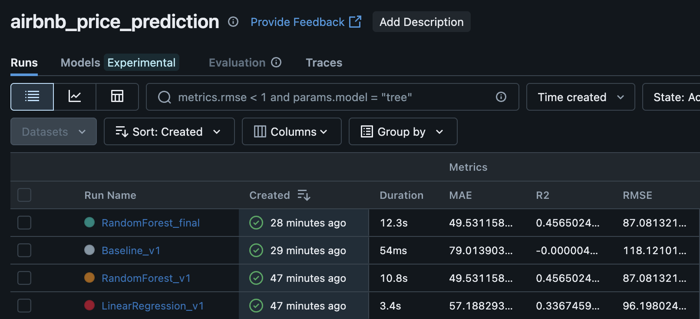
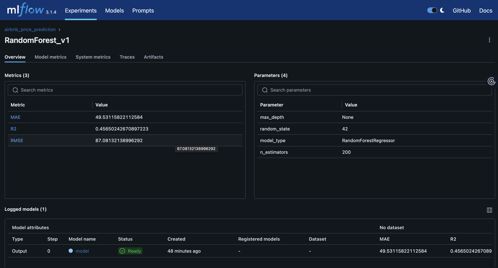
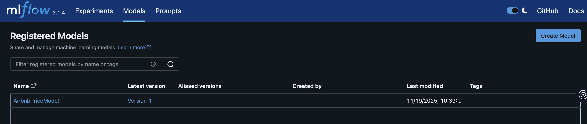

# Predicting Airbnb Listing Prices with MLflow and AWS S3

## 📌 Project Overview

This project builds a machine learning pipeline to predict nightly Airbnb listing prices. The goal is to help StayWise hosts set competitive pricing based on location, room type, reviews, and availability.

The workflow follows industry standards, including:

- Retrieving data from AWS S3
- Cleaning and preprocessing the dataset
- Feature engineering
- Training multiple regression models
- Tracking experiments with MLflow
- Registering the best-performing model
- Ensuring full reproducibility via GitHub version control

---

## 🎯 Project Objectives

1. Load Airbnb listings dataset stored in AWS S3
2. Perform end-to-end data preprocessing and feature engineering
3. Develop and evaluate multiple regression models
4. Track all experiments using MLflow
5. Register the best model in the MLflow Model Registry
6. Document the entire workflow in a well-organized GitHub repository

---

## 🗂️ Repository Structure

```
airbnb-price-mlflow-s3/
├── notebooks/
│   └── Predict_Airbnb_Listing_Prices.ipynb
├── img/
├── venv/
├── mlruns/
├── .gitignore
├── requirements.txt
└── README.md
```

---

## ⚙️ Setup & Installation

### **1. Clone the repository**

```bash
git clone https://github.com/valeriesolis/airbnb-price-mlflow-s3.git
cd airbnb-price-mlflow-s3
```

### **2. Create and activate a virtual environment**

```bash
# macOS/Linux
python3 -m venv venv
source venv/bin/activate

# Windows
python -m venv venv
venv\Scripts\activate
```

### **3. Install dependencies**

```bash
pip install -r requirements.txt
```

### **4. Configure AWS Credentials**

Run the AWS configuration command:

```bash
aws configure
```

Enter the following when prompted:

- AWS Access Key ID
- AWS Secret Access Key
- Default region name
- Default output format

### **5. Run the Jupyter Notebook**

Launch Jupyter Notebook:

```bash
jupyter notebook
```

Navigate to `notebooks/Predict_Airbnb_Listing_Prices.ipynb` and run all cells.

### **6. Start MLflow UI**

From the project root directory:

```bash
mlflow ui --port 5000
```

Open your browser and navigate to: `http://127.0.0.1:5000`

---

## 🧪 Machine Learning Workflow

### 1. Data Source

Dataset stored in AWS S3:

```text
s3://val-ai-ml-project-2077/airbnb/raw_data/AB_NYC_2019.csv
```

Loaded using:

- `boto3`
- `s3fs`
- `pandas`

### **2. Data Cleaning**

Steps include:

- Handling missing values
- Removing invalid rows
- Treating outliers
- Converting datatypes
- Dropping unnecessary fields

### **3. Feature Engineering**

Created meaningful additional variables:

- `has_review` (binary indicator)
- `days_since_last_review` (numeric feature)
- One-hot encoded categorical variables
- Removed ambiguous or leak-prone columns

### **4. Model Development**

Models trained:

- **Baseline** (mean predictor)
- **Linear Regression**
- **Random Forest Regressor**

Metrics evaluated:

- Mean Absolute Error (MAE)
- Root Mean Squared Error (RMSE)
- R² Score

### **5. Experiment Tracking with MLflow**

MLflow was used to:

- Log metrics (MAE, RMSE, R²)
- Log parameters (hyperparameters, model type)
- Save trained model artifacts
- Compare runs visually in the UI
- Register the final Random Forest model as: `AirbnbPriceModel`

---

## 📊 Model Performance Results

| Model | MAE | RMSE | R² Score |
| --- | --- | --- | --- |
| Baseline | 79.01 | 118.12 | -0.000004 |
| Linear Regression | 57.19 | 96.20 | 0.337 |
| Random Forest | 49.53 | 87.08 | 0.457 |
| Random Forest Final | 49.53 | 87.08 | 0.457 |

**Key Takeaway:** Random Forest achieved the best performance with the lowest MAE/RMSE and highest R² score, outperforming both the baseline and linear regression models.

---

## 📸 MLflow Screenshots

### 🔹 Experiment Comparison Table



*Screenshot showing Baseline, LinearRegression_v1, and RandomForest_v1 metrics side by side*

### 🔹 Run Detail Page



*Screenshot of RandomForest_v1 showing logged metrics and parameters*

### 🔹 Model Registry



*Screenshot showing the registered model: AirbnbPriceModel, Version 1*

---

## 🔍 Key Insights & Observations

1. **Baseline Model Performance**: The baseline model performs poorly (negative R²), confirming that simply predicting the mean price is not useful.
2. **Linear Regression Improvement**: Linear Regression demonstrates significant improvement over the baseline, indicating that the engineered features have meaningful predictive power.
3. **Random Forest Success**: Random Forest achieves the best results with:
    - 37% lower MAE compared to baseline
    - 26% lower RMSE compared to baseline
    - R² of 0.457, explaining ~46% of price variance
4. **MLflow Value**: MLflow provided clear, structured experiment logs and supported reproducible model versioning throughout the development process.

---

## 🏁 Conclusion

This project demonstrates a complete end-to-end machine learning workflow:

✅ Cloud-based data ingestion (AWS S3)

✅ Structured preprocessing pipeline

✅ Multiple model experiments

✅ MLflow tracking and model registry

✅ Fully reproducible GitHub repository

The final registered model (`AirbnbPriceModel`) is ready for integration into StayWise's pricing engine or future deployment pipelines.

---

## 🔧 Dependencies

Key libraries used:

- `pandas` - Data manipulation
- `numpy` - Numerical operations
- `scikit-learn` - Machine learning models
- `mlflow` - Experiment tracking and model registry
- `boto3` / `s3fs` - AWS S3 integration
- `matplotlib` / `seaborn` - Visualization

See `requirements.txt` for complete list.